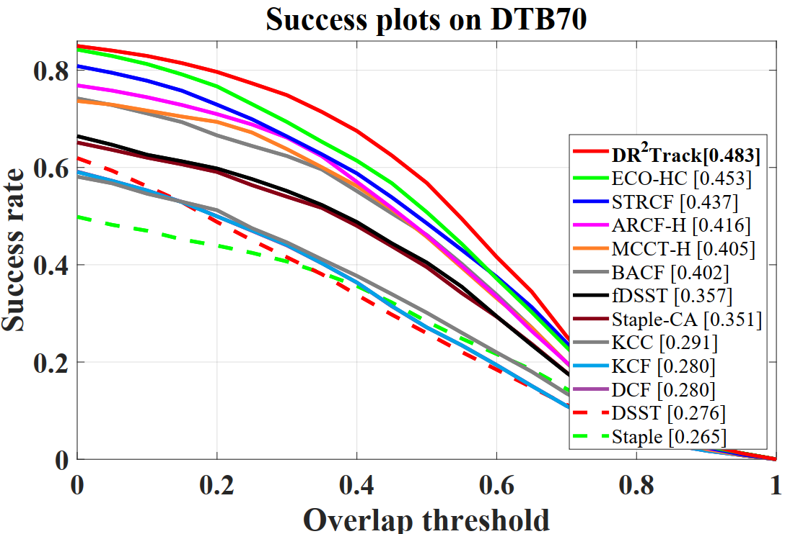

# DR²Track:  Towards Real-Time Visual Tracking for UAV via Distractor Repressed Dynamic Regression
Matlab implementation of our Distractor Repressed Dynamic Regression tracker (DR²Track).

# Abstract

Visual tracking has yielded promising applications with unmanned aerial vehicle (UAV). In literature, the advanced discriminative correlation filter (DCF) type trackers generally distinguish the foreground from the background with a learned regressor which regresses the implicit circulated samples into a fixed target label. However, the predefined and unchanged regression target results in low robustness and adaptivity to uncertain aerial tracking scenarios. In this work, we exploit the local maximum points of the response map generated in the detection phase to automatically locate current distractors1. By repressing the response of distractors in the regressor learning, we can dynamically and adaptively alter our regression target to leverage the tracking robustness as well as adaptivity. Substantial experiments conducted on three challenging UAV benchmarks demonstrate both excellent performance and extraordinary speed (∼50fps on a cheap CPU) of our tracker.
# Publication

DR²Track is proposed in our paper accepted by IROS 2020. Detailed explanation of our method can be found in the paper:

Changhong Fu, Fangqiang Ding,  Yiming Li, Jin Jin and Chen Feng.

DR²Track:  Towards Real-Time Visual Tracking for UAV via Distractor Repressed Dynamic Regression  

https://arxiv.org/abs/2008.03912

If you want to refer to this paper, please cite it as follows:

@article{Fu2020Towards,

author = {Changhong Fu and Fangqiang Ding and Yiming Li and Jin Jin and Chen Feng},

title = {DR^2Track: Towards Real-Time Visual Tracking for UAV via Distractor Repressed Dynamic Regression},

year = {2020},

journal = {arXiv:2008.03912}

}

# Contact

Changhong Fu

Email: [changhong.fu@tongji.edu.cn](mailto:changhong.fu@tongji.edu.cn)

Fangqiang Ding

Email: dfq.toytiny@gmail.com

# Demonstration running instructions

This code is compatible with UAV123@10fps, DTB70 and UAVDT benchmark. Therefore, if you want to run it in benchmark, just put DR2Track folder in trackers, and config sequences and trackers according to instructions from aforementioned benchmarks. 

# Results on UAV datasets

### UAV123@10fps

### DTB70

### UAVDT

# Acknowledgements

We thank the contribution of  Feng Li, Ning Wang and Martin Danelljan for their previous work STRCF,  MCCT-H and DSST.  The feature extraction modules and some of the parameter are borrowed from the MCCT tracker (https://github.com/594422814/MCCT). The scale estimation method is borrowed from the DSST tracker (http://www.cvl.isy.liu.se/en/research/objrec/visualtracking/scalvistrack/index.html).

