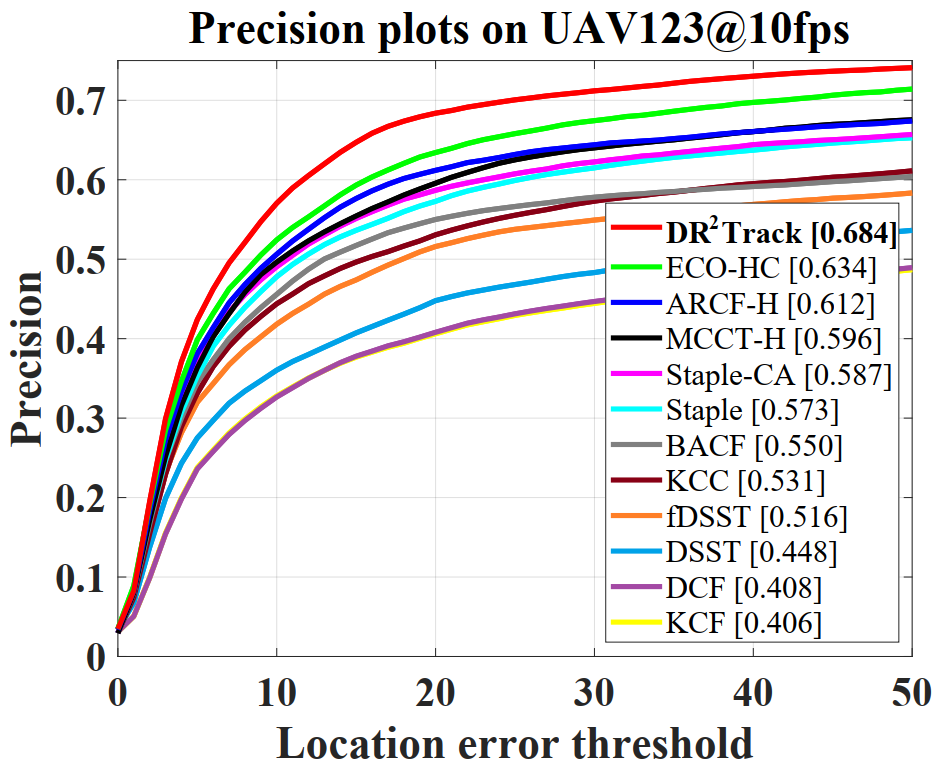
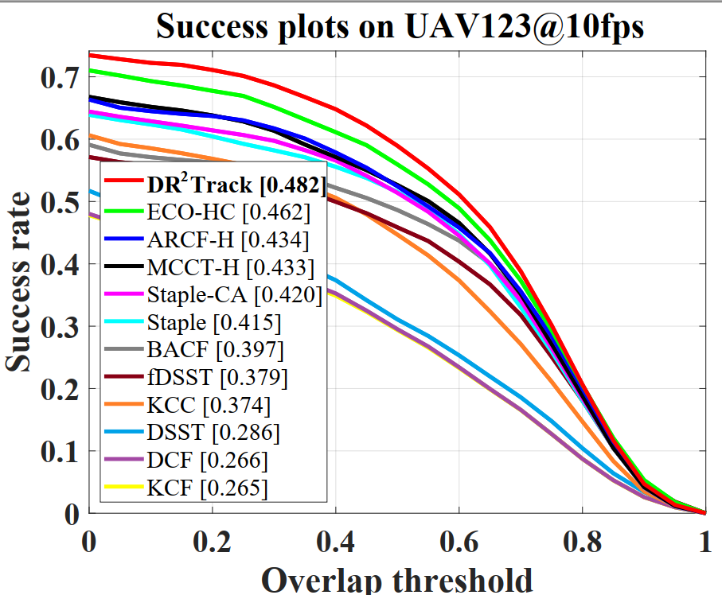
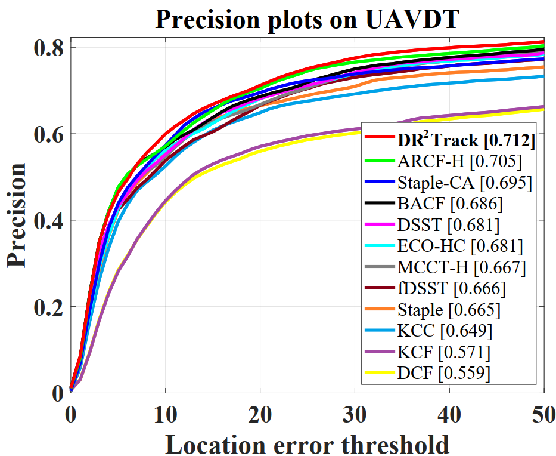

# Learning Dynamic Regression with Automatic Distractor Repression for Real-Time UAV Tracking  
Matlab implementation of our Distractor Repressed Dynamic Regression tracker (DR²Track).

# Abstract

With high efficiency and efficacy, the trackers based on discriminative correlation filter have experienced rapid development in the field of unmanned aerial vehicle (UAV) over the past decade. Generally, most such trackers aim at solving a regression problem in which the circulated samples are mapped into a Gaussian label for online filter training. However, the fixed target label for regression makes trackers lose adaptivity
in uncertain tracking scenarios. One of the typical failure cases is that unforeseeable distractors can visually confuse the trackers. In this work, we propose to instantly monitor the local maximums of the response map for discovering distractors automatically. Afterwards, the regression target is accordingly learned: the
location possessing local maximum indicates latent distractor, and thus should be repressed by reducing its target response value in filter training. Exhaustive and extensive experiments are performed on three challenging UAV benchmarks. Our method not only outperforms the state-of-the-art handcrafted
feature-based trackers, but also exhibits comparable performance compared to deep learning-based approaches. Most tellingly, our tracker has phenomenal practicability in real-time UAV applications with an average speed of ∼50 frames per second on an affordable CPU.  

# Publication

DR²Track is proposed in our paper for EAAI. Detailed explanation of our method can be found in the paper:

Changhong Fu, Fangqiang Ding,  Yiming Li,  Jin Jin and Chen Feng.

Learning Dynamic Regression with Automatic Distractor Repression for Real-Time UAV Tracking  

# Contact

Changhong Fu

Email: [changhong.fu@tongji.edu.cn](mailto:changhong.fu@tongji.edu.cn)

Fangqiang Ding

Email: dfq.toytiny@gmail.com

# Demonstration running instructions

This code is compatible with UAV123@10fps, DTB70 and UAVDT benchmark. Therefore, if you want to run it in benchmark, just put DR2Track folder in trackers, and config sequences and trackers according to instructions from aforementioned benchmarks. 

# Results on UAV datasets

### UAV123@10fps

### DTB70

### UAVDT

# Acknowledgements

We thank the contribution of  Feng Li, Ning Wang and Martin Danelljan for their previous work STRCF,  MCCT-H and DSST.  The feature extraction modules and some of the parameter are borrowed from the MCCT tracker (https://github.com/594422814/MCCT). The scale estimation method is borrowed from the DSST tracker (http://www.cvl.isy.liu.se/en/research/objrec/visualtracking/scalvistrack/index.html).

